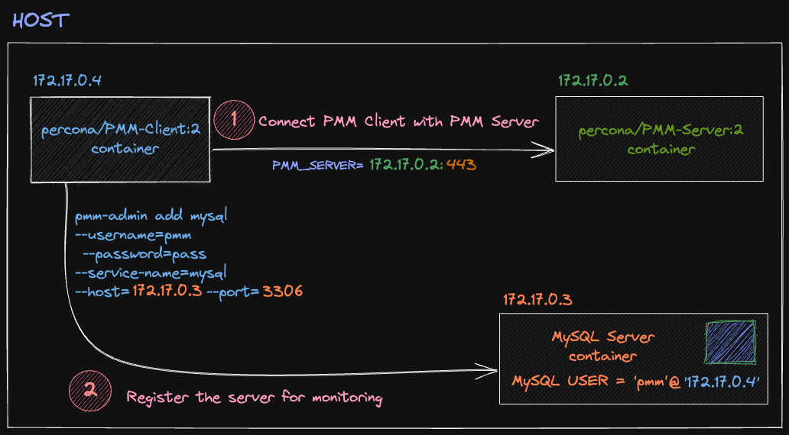

# PMM Server, PMM Client and MySQL containers

<p align="center">

</p>

## Set Up MySql Docker container

```bash
# Pulling MySQL image
docker pull mysql:8.0

# Running MySQL container
docker run --name my-mysql -e MYSQL_ROOT_PASSWORD=<secret-password> -v $HOME/mysql-data:/var/lib/mysql -d mysql:8.0

# Enter into MySQL container
docker exec -it <mysql-container-id> /bin/bash

# Run MySQL
mysql -uroot -p<secret-password>
```

Create a basic database and a table

```bash
CREATE DATABASE movie;
use school;
INSERT INTO tblemployee (employee_first_name, employee_last_name) values ('Nisarg','Upadhyay')
select * from tblEmployee;
INSERT INTO tblemployee (employee_first_name, employee_last_name) values ('Edith','Puclla')
select * from tblEmployee;
```

Create a PMM user for monitoring. Use the IP of the client container, who through this user, will connect to the MySQL database.

```bash
Creating use:
CREATE USER 'pmm'@'172.17.0.4' IDENTIFIED BY 'pass' WITH MAX_USER_CONNECTIONS 10;
GRANT SELECT, PROCESS, SUPER, REPLICATION CLIENT, RELOAD, BACKUP_ADMIN ON *.* TO 'pmm'@'172.17.0.4';
```

## Set Up PMM Server Docker container

```bash
# Pulling PMM Server image
docker pull percona/pmm-server:2
```

```bash
# Create a volume fof PMM Server to persist the data
docker volume create pmm-data
```

```bash
# Run the container of PMM Server
docker run --detach --restart always \
--publish 443:443 \
-v pmm-data:/srv \
--name pmm-server \
percona/pmm-server:2
```

See more about [PMM Server Docs](https://docs.percona.com/percona-monitoring-and-management/setting-up/server/docker.html)

## Set Up PMM Client Docker container

```bash
# Pulling PMM PMM Client image
docker pull \
percona/pmm-client:2
```

```bash
# Create a container volume to persist the data
docker create \
--volume /srv \
--name pmm-client-data \
percona/pmm-client:2 /bin/true
```

```bash
# Setting PMM_SEVER parameter, with the IP of the container of PMM Server
PMM_SERVER=172.17.0.2:443
```

```bash
# Run PMM client container, use the user name and password set to PMM Server
docker run \
--rm \
--name pmm-client \
-e PMM_AGENT_SERVER_ADDRESS=${PMM_SERVER} \
-e PMM_AGENT_SERVER_USERNAME=admin \
-e PMM_AGENT_SERVER_PASSWORD=admin20 \
-e PMM_AGENT_SERVER_INSECURE_TLS=1 \
-e PMM_AGENT_SETUP=1 \
-e PMM_AGENT_CONFIG_FILE=config/pmm-agent.yaml \
--volumes-from pmm-client-data \
percona/pmm-client:2
```

See more about [PMM Client Docs](https://docs.percona.com/percona-monitoring-and-management/setting-up/client/index.html)

## Conecting the DataBase with PMM Client

```bash
# Register the DataBase from PMM Client container, use the IP of MySQL container
pmm-admin add mysql --username=pmm --password=pass --service-name=mysql --host=172.17.0.3 --port=3306
```

## Utilities

```bash
# Get IP of a Container
docker inspect -f '{{range.NetworkSettings.Networks}}{{.IPAddress}}{{end}}' <container-IP>

```
